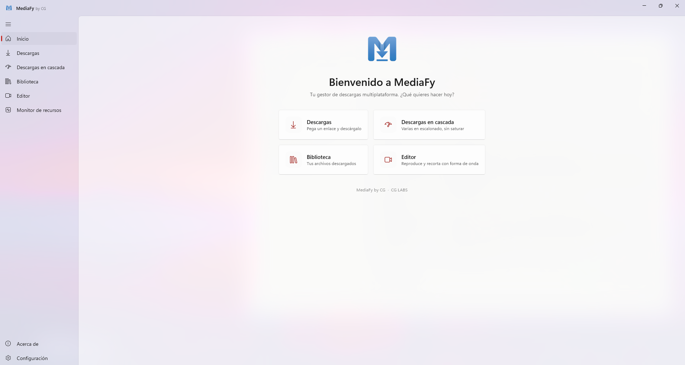
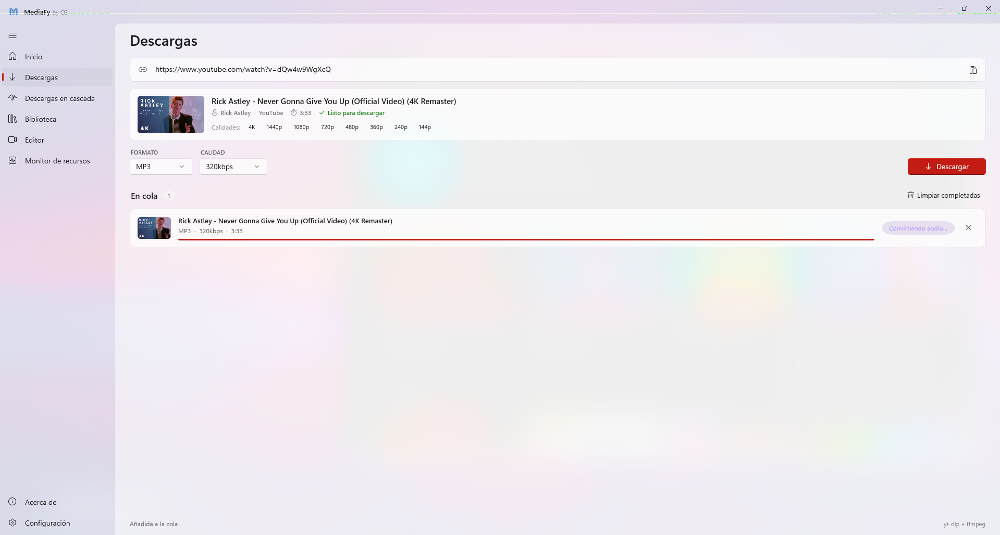
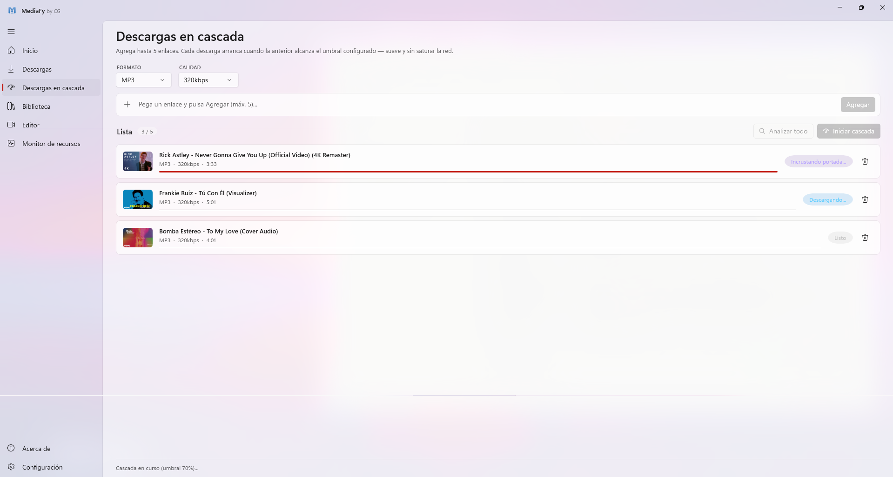
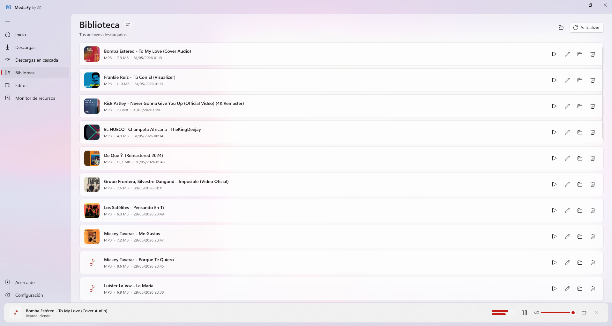
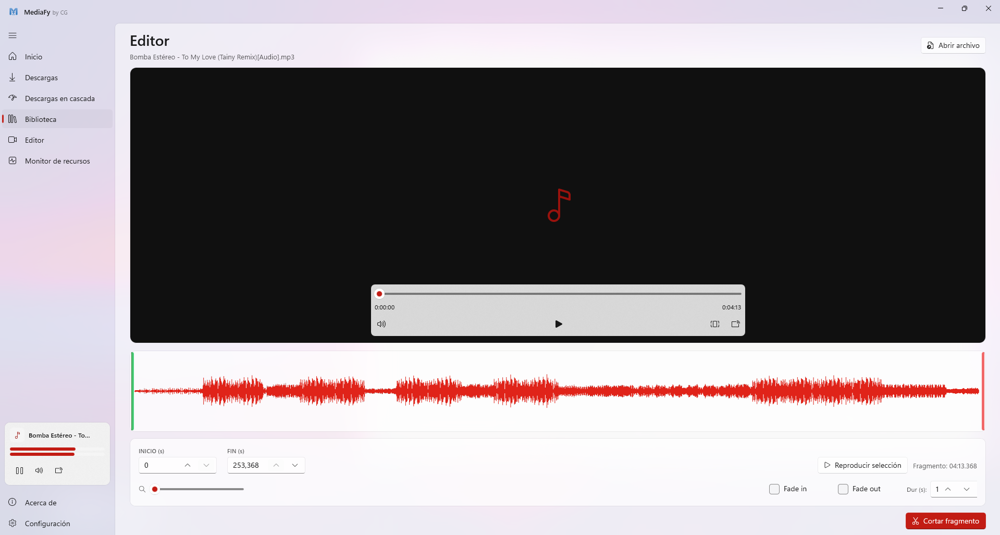
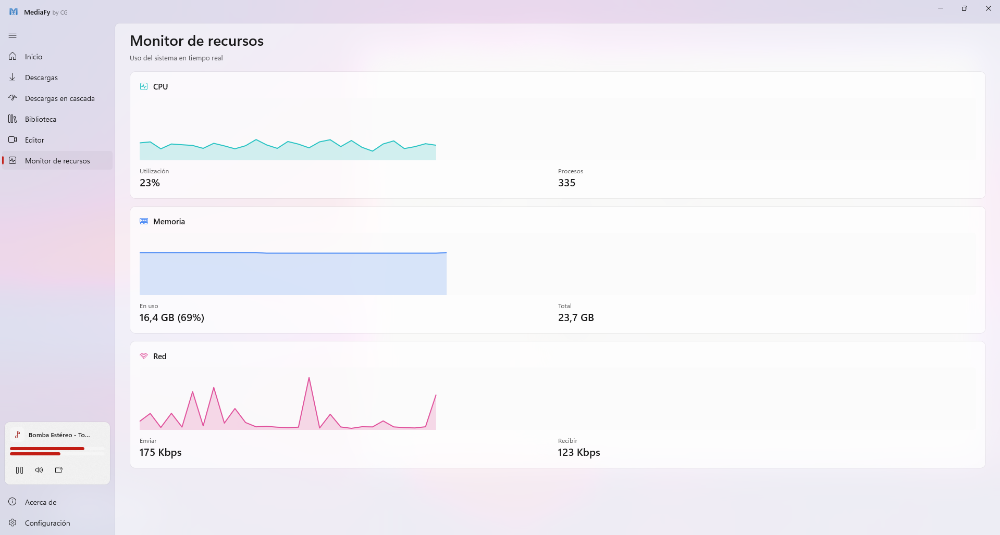
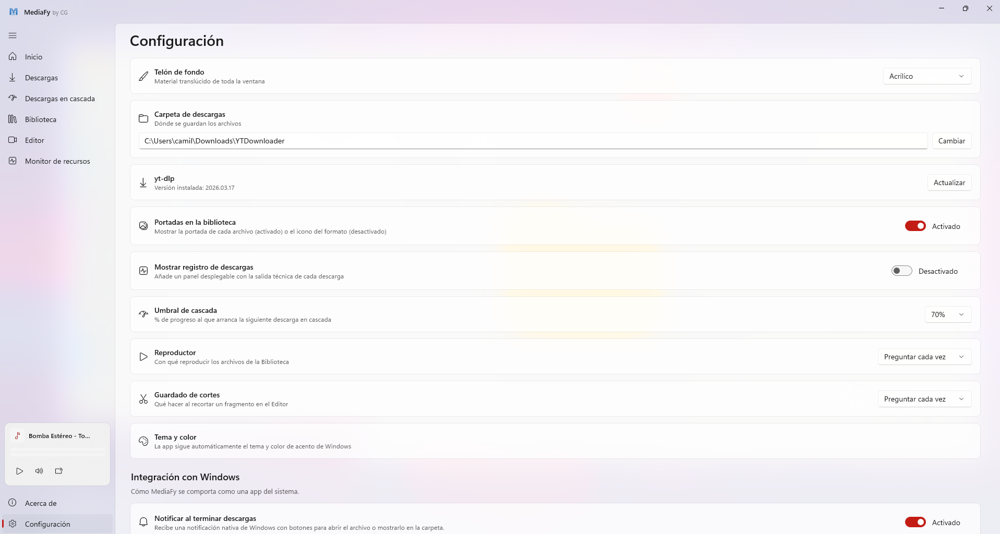
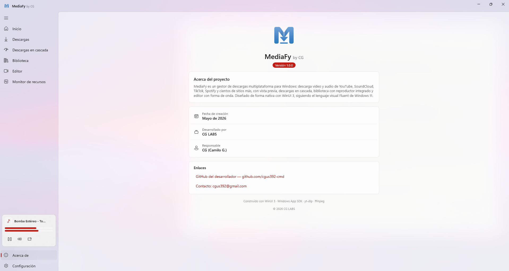
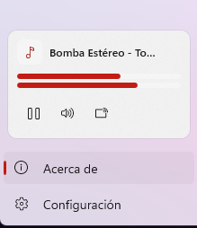

<div align="center">


# MediaFy by CG

### Tu gestor de descargas multiplataforma para Windows

*Descarga vídeo y audio de cientos de sitios con la elegancia de WinUI 3.*

[](https://www.microsoft.com/windows/)
[](https://dotnet.microsoft.com/)
[](https://learn.microsoft.com/windows/apps/winui/winui3/)
[](https://github.com/cgus392-cmd/MediaFy/releases)
[](https://github.com/cgus392-cmd)

[**📥 Descargar**](#-instalación) ·
[**✨ Funciones**](#-funciones-principales) ·
[**📸 Capturas**](#-capturas) ·
[**🧩 Extensión**](#-extensión-de-navegador) ·
[**🛠️ Tecnologías**](#️-tecnologías)

</div>

---

<p align="center">
  
</p>

## 💡 ¿Qué es MediaFy?

**MediaFy** es una aplicación nativa de Windows construida con **WinUI 3 + .NET 8** que convierte la descarga de contenido multimedia en una experiencia *fluida, elegante y profesional*.

No es solo un descargador de YouTube — es un **gestor completo** con biblioteca, reproductor con VU‑meter, editor con forma de onda, cascada de descargas escalonadas, telones de fondo Mica/Acrílico configurables, integración profunda con Windows y soporte para **más de 1000 sitios**.

> Diseñada al detalle siguiendo el lenguaje visual **Fluent Design** de Windows 11.

---

## ✨ Funciones principales

### 🎬 Descargas potentes
- **Vista previa instantánea** al pegar un enlace: portada, título, canal, duración y calidades disponibles
- **Descargas múltiples simultáneas** configurables (1–5)
- **Progreso en vivo**: velocidad (MB/s), ETA y tamaño descargado/total
- **Cancelar y reintentar** cualquier descarga
- **Cascada escalonada** estilo Google Play Store: la siguiente descarga arranca cuando la anterior llega al umbral configurable (50–90 %)

### 🌐 Multiplataforma de verdad
YouTube · SoundCloud · **Spotify** *(sin Premium ni credenciales)* · TikTok · Instagram · Twitter / X · Vimeo · Twitch · Facebook · Dailymotion · Bandcamp · y ~1000 sitios más vía **yt‑dlp**.

Cada plataforma se activa o desactiva con su propio interruptor en **Configuración**.

### 📚 Biblioteca con vida
- **Portadas reales** extraídas de cada archivo (configurable)
- **Reproductor global persistente** con **VU‑meter de 2 canales en vivo** que sobrevive a la navegación entre secciones
- Búsqueda rápida en explorador, eliminación con confirmación
- Integración con el panel de volumen y teclas multimedia de Windows (**SMTC**)

### 🎛️ Editor PRO con forma de onda
- **Waveform real** generado por ffmpeg, en el color de acento del sistema
- **Selección arrastrable** sobre la onda (manijas verde/rojo)
- **Reproducir solo la selección** antes de cortar
- **Tiempos editables** con precisión de 0.1 s
- **Fade in / out** + **zoom** (1× – 8×)
- Guardado configurable: copia nueva, reemplazar original, o preguntar

### 🎨 Apariencia totalmente personalizable
**Mica · Mica Alt · Acrílico · Acrílico fino · Ninguno**, aplicado a la ventana completa en vivo.
Sincronización automática con el tema y color de acento del sistema.

### 📊 Monitor de recursos integrado
Tarjetas estilo Dev Home con gráficas en vivo de **CPU, Memoria y Red**, leyendo datos reales del sistema (`GetSystemTimes`, `GlobalMemoryStatusEx`, `NetworkInterface`).

### 🔔 Integración profunda con Windows
- **Notificaciones toast** al terminar cada descarga (con botones *Abrir archivo* / *Mostrar en carpeta*)
- **Iniciar con Windows** en bandeja, modo silencioso
- **Bandeja del sistema**: cerrar la ventana minimiza a la bandeja
- **Auto‑actualización** de yt‑dlp al arrancar (configurable)

### 🧩 Extensión de navegador
Botón **"Descargar con MediaFy"** disponible desde Chrome, Edge, Brave y Opera mediante el protocolo `mediafy://`.
Asistente de instalación guiado paso a paso integrado en la propia app.

---

## 📥 Instalación

### Opción 1 — Instalador (recomendado)
Descarga `MediaFy-Setup-1.0.0.exe` desde la **[última Release](https://github.com/cgus392-cmd/MediaFy/releases/latest)**, ejecútalo y sigue los pasos. Incluye accesos directos, desinstalador y registro completo del protocolo `mediafy://`.

### Opción 2 — Portable
Descarga `MediaFy-Portable-1.0.0.zip`, descomprime donde quieras (USB, escritorio…) y ejecuta `MediaFy.exe`. Sin instalación, sin registro.

### Requisitos
- Windows **10 (1809)** o superior — Windows 11 recomendado
- ~280 MB de espacio (incluye .NET 8, WinUI 3, yt‑dlp y ffmpeg integrados)

---

## 📸 Capturas

<table>
  <tr>
    <td width="50%">
      <p align="center"><b>Descargas con vista previa</b></p>
      
    </td>
    <td width="50%">
      <p align="center"><b>Descargas en cascada</b></p>
      
    </td>
  </tr>
  <tr>
    <td>
      <p align="center"><b>Biblioteca con portadas</b></p>
      
    </td>
    <td>
      <p align="center"><b>Editor con forma de onda</b></p>
      
    </td>
  </tr>
</table>

<details>
<summary><b>📂 Ver más capturas (Monitor, Configuración, Acerca de, Reproductor global)</b></summary>
<br/>
<table>
  <tr>
    <td width="50%">
      <p align="center"><b>Monitor de recursos</b></p>
      
    </td>
    <td width="50%">
      <p align="center"><b>Configuración (Apariencia)</b></p>
      
    </td>
  </tr>
  <tr>
    <td>
      <p align="center"><b>Acerca de</b></p>
      
    </td>
    <td>
      <p align="center"><b>Reproductor global con VU‑meter</b></p>
      
    </td>
  </tr>
</table>

Todas las capturas viven en <a href="docs/screenshots/"><code>docs/screenshots/</code></a>.
</details>

---

## 🧩 Extensión de navegador

MediaFy incluye una **extensión Manifest V3** para Chrome, Edge, Brave y Opera que añade un botón **"Descargar con MediaFy"** en YouTube, SoundCloud, TikTok, Spotify, Vimeo y más.

### Instalación guiada (la fácil)
1. Abre MediaFy → **Configuración → Conexión externa → Extensión de navegador → Instalar**
2. El asistente abre tu navegador en la página de extensiones **y** la carpeta correcta a la vez
3. Activas *Modo desarrollador* → *Cargar descomprimida* → seleccionas → listo ✅

### Manual
Carpeta en el repo: [`extension/`](extension/). Lee su [README](extension/README.md).

> Al instalar MediaFy con el instalador, el protocolo `mediafy://` queda registrado oficialmente en Windows.

---

## 🛠️ Tecnologías

| Capa | Tecnología |
|---|---|
| UI | **WinUI 3** (Windows App SDK 1.6) — el mismo motor que Files App |
| Plataforma | **.NET 8** (C# 12), `net8.0-windows10.0.19041.0` |
| Backdrop | `MicaController` / `DesktopAcrylicController` vía composition |
| Reproducción | `MediaPlayer` + `SystemMediaTransportControls` + `AudioStateMonitor` |
| Descarga | **yt‑dlp** (binario empaquetado) |
| Conversión / waveform / cortes | **ffmpeg** (binario empaquetado) |
| Spotify | Scraping del `__NEXT_DATA__` del reproductor público (sin DRM, sin API) |
| Notificaciones | `Microsoft.Windows.AppNotifications` |
| Bandeja | `H.NotifyIcon.WinUI` |
| Single‑instance + protocolo | `Microsoft.Windows.AppLifecycle` + `HKCU\Software\Classes` |
| Persistencia | JSON en `%LocalAppData%\YTDownloader\settings.json` |
| Instalador | **Inno Setup 6** |

---

## 🚀 Compilar desde el código

Necesitas:
- **Visual Studio 2022** con los workloads *.NET Desktop development* y *Windows App SDK C# Templates*
- **.NET 8 SDK**

```powershell
git clone https://github.com/cgus392-cmd/MediaFy.git
cd MediaFy\YTDownloaderWinUI
# Compilar con MSBuild de VS (no con `dotnet build`: WinUI 3 necesita las tareas de Visual Studio)
& "C:\Program Files\Microsoft Visual Studio\2022\Community\MSBuild\Current\Bin\amd64\MSBuild.exe" `
  YTDownloaderWinUI.csproj /t:Restore,Build /p:Configuration=Release /p:Platform=x64 /p:RuntimeIdentifier=win-x64
```

Para generar el instalador:
```powershell
ISCC.exe installer\MediaFy.iss
```

---

## 🗂️ Estructura del repo

```
MediaFy/
├── YTDownloaderWinUI/      ← La app (WinUI 3 + .NET 8)
│   ├── Core/               ← Servicios: descargas, Spotify, ffmpeg, bandeja, notif…
│   ├── Models/             ← DownloadItem, LibraryFile, VideoInfo…
│   ├── Views/              ← Páginas: Home, Downloads, Cascade, Library, Editor…
│   ├── Assets/             ← Logo + yt-dlp.exe + ffmpeg.exe
│   └── MainWindow.xaml     ← Shell con NavigationView + reproductor global
├── extension/              ← Extensión Manifest V3 para Chrome/Edge
├── installer/              ← Script de Inno Setup
└── docs/                   ← Logo + capturas
```

---

## 🗺️ Roadmap

- [x] Núcleo de descargas con vista previa
- [x] Descargas múltiples + cascada escalonada
- [x] Editor con forma de onda
- [x] Biblioteca + reproductor global con VU
- [x] Apariencia configurable (Mica/Acrílico)
- [x] Multiplataforma (~1000 sitios) + Spotify
- [x] Integración profunda con Windows (toast, bandeja, autoarranque, SMTC)
- [x] Extensión de navegador
- [x] Instalador clásico + portable
- [x] Auto‑update de MediaFy
- [x] Organizador de archivos dual‑pane
- [x] Drag & drop de enlaces y archivos
- [x] Vigilar portapapeles
- [x] Tutorial de bienvenida con mockup y animaciones
- [x] Búsqueda de YouTube integrada (Descargas y Cascada)
- [x] Más formatos/calidad/subtítulos + preferencias por defecto
- [x] Descarga de álbumes/listas pista por pista (carpeta + numeración)
- [ ] Cola persistente entre reinicios
- [ ] Mini‑player flotante always‑on‑top
- [ ] Buscador en la biblioteca

### 🔮 Plan B / a futuro

- **Motor de JavaScript para YouTube (EJS):** yt‑dlp deprecó su intérprete interno y recomienda un
  runtime JS (Deno por defecto) para resolver los desafíos *nsig* de YouTube. Por ahora la descarga
  pista‑por‑pista evita los cuelgues, así que no es urgente. Si YouTube aprieta con los formatos, el
  plan es **detectar Node/Deno/Bun del sistema** y, solo si no hay ninguno, **descargar Deno bajo
  demanda** (sin engordar el instalador con ~110 MB).

---

## 👤 Autor

**Camilo G. (CG)** — bajo la marca personal **CG LABS**

📦 GitHub: [@cgus392-cmd](https://github.com/cgus392-cmd) · 📧 cgus392@gmail.com

---

## 📄 Licencia

Proyecto personal de **CG LABS**. Uso personal y educativo.
Las herramientas de terceros incluidas (yt‑dlp, ffmpeg) se distribuyen bajo sus propias licencias.

---

<div align="center">

**Si MediaFy te parece útil, dale una ⭐ al repo.**

*Hecho con ❤️ y mucho Fluent Design por CG LABS · 2026*

</div>
